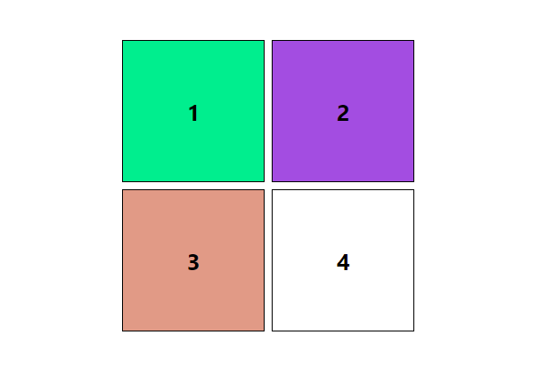

# GameOfSquares
A simple project made for just practice.  
  
This this made by using HTML,CSS &amp; JS. 

<h3>Here, you will get to see 4 boxes and each with differnt functionality</h3>
<ul>
  <li>BOX-1</li>
  <dl>Hovering BOX-1 will generate random numbers from 1 to 100</dl>
  <li>BOX-2</li>
  <dl>Hovering BOX-2 will generate 3 colors i.e Red, Green, Blue Alternately</dl>
  <li>BOX-3</li>
  <dl>Hovering BOX-3 will generate random colors </dl>
  <li>BOX-4</li>
  <dl>Clicking BOX-4 will generate 3 random colors in the BOX-1, BOX-2 and BOX-3</dl>
</ul>
See the source code to explore more features of this and do not forget to enjoy the code and functionalities.
<h1> All rights reserved by Dev Rohh :) </h1>
